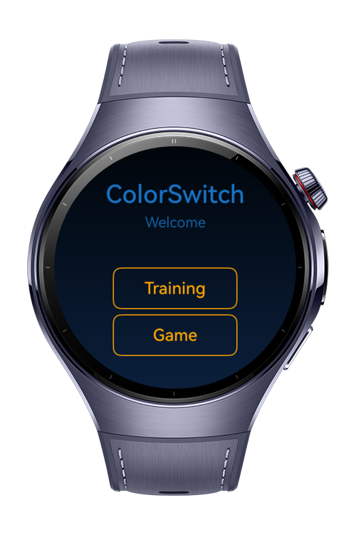
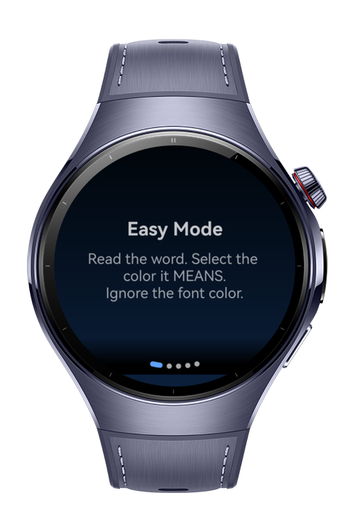
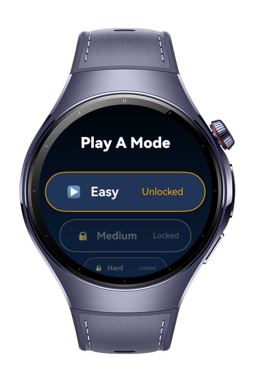

> **Note:** To access all shared projects, get information about environment setup, and view other guides, please visit [Explore-In-HMOS-Wearable Index](https://github.com/Explore-In-HMOS-Wearable/hmos-index).

# ColorSwitch

ColorSwitch is a HarmonyOS Next app designed to improve focus, reaction time, and memory through interactive color-based training games.
Users can select a difficulty mode (Easy, Medium, Hard, Expert), complete timed tasks, and receive feedback with scores and badges.

# Preview

<div>
  
  
  
  
</div>


# Use Cases

- Start training sessions with different modes: Easy, Medium, Hard, Expert.

- Each training consists of time-limited color selection tasks.

- Scoring rules:

    -  Initial time: 60 seconds

    - Correct answer: +5 points and +5 seconds

    - Wrong answer: -10 points and -10 seconds

- Track results with a score system and motivational feedback (Try Again, Rising Star, Perfect!).

- Navigate through structured pages: Home → Training List → Training → Mode Select → Game → Result.

- Motivation through gamification: retry failed attempts, improve scores, and reach higher ranks.

# Technology

## Stack
**Languages**: ArkTS

**Frameworks**: HarmonyOS SDK 5.1.0(18)

**Tools**: DevEco Studio Vers 5.1.0.842

**Libraries**: @ohos.vibrator, @kit.ArkUI, @kit.ArkData


## Required Permissions

- `ohos.permission.VIBRATE`


# Directory Structure
```
entry/src/main/ets/  
├── components/  
│   ├── GameQuestionCard.ets        # UI card for displaying game questions  
│   └── QuizCard.ets                # Quiz card component for training tasks  
│  
├── model/  
│   └── TrainingTypes.ets           # Data model for training modes/types  
│  
├── pages/  
│   ├── GamePage.ets                # Main game page (timer, questions, scoring)  
│   ├── HomePage.ets                # Landing page with start button  
│   ├── Index.ets                   # Entry point page  
│   ├── ModeListPage.ets            # Select difficulty (Easy / Medium / Hard / Expert)  
│   ├── ResultPage.ets              # Displays final score & feedback  
│   ├── TrainingListPage.ets        # Training categories list  
│   └── TrainingPage.ets            # Training instructions/setup  
│  
├── services/  
│   ├── HapticService.ets           # Manages vibration feedback for actions  
│   └── NavigationService.ets       # Handles page navigation  
│  
├── utils/  
│   ├── GameRepo.ets                # Core repository for managing game state  
│   ├── QuestionBank.ets            # Stores questions/tasks for training  
│   ├── TrainingCopy.ets            # Provides static text/instructions for training  
│   └── UnlockPrefs.ets             # Stores and retrieves unlocked modes/preferences  
│  
├── viewmodel/  
│   ├── BaseViewModel.ets           # Base shared state handler  
│   ├── TrainingViewModel.ets       # Controls training/game logic  
│   └── Modes.ets                   # Defines available modes (Easy, Medium, Hard, Expert)  
│  
├── entryability/  
│   └── EntryAbility.ets            # App entry point ability  
│  
├── module.json5                     # App metadata & permissions  
└── build-profile.json5              # Build, signing, and SDK info  

```


# Constraints and Restrictions

## Supported Device
- Huawei Watch 5


# License

ColorSwitch is distributed under the terms of the MIT License.

See the [LICENSE](/LICENSE) for more information.